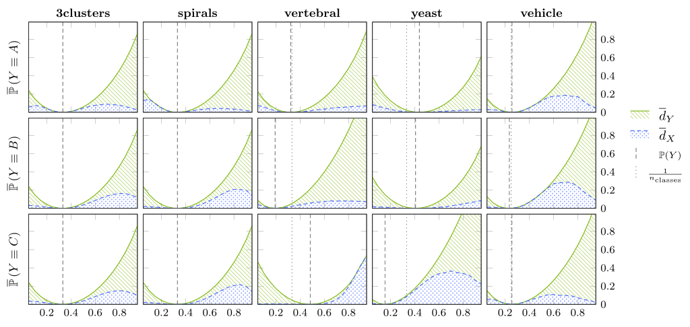
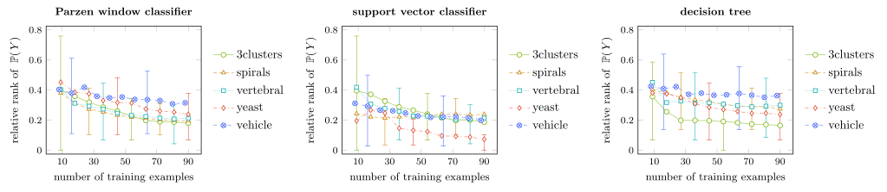

# Optimal Classifiers in Active Class Selection

This repository contains supplementary material our paper "Optimal Probabilistic Classification in Active Class Selection" published at ICDM 2020.

```
@InProceedings{bunse2020optimal,
  author    = {Bunse, Mirko and Weichert, Dorina and Kister, Alexander and Morik, Katharina},
  title     = {Optimal Probabilistic Classification in Active Class Selection},
  booktitle = {International Conference on Data Mining (ICDM)},
  publisher = {IEEE},
  year      = {2020},
  note      = {In press}
}
```

All results we present in this paper can be reproduced with GNU Make.
You can either run the experiments locally or in a Docker container.


## Local setup with Conda

Start by creating and activating the Conda environment:

    conda env create -f environment.yml 
    conda activate acs-sandbox

The above steps will install all dependencies in an isolated Conda environment,
so that they do not conflict with or alter the other Python packages you might have installed.


## Docker setup (advanced)

Make sure that [Docker](https://www.docker.com/) is installed and that you
have a certain level of familiarity with the platform.
If you rather stick to the local setup, you can skip this section.

First, create a Docker image using GNU Make:

    cd docker && make

**Advanced:**
In case your setup requires all images to be pushed to some Docker registry,
use the `push` target of GNU Make. This target requires the registry to be
specified through the `DOCKER_REPOSITORY` variable.

    cd docker/
    DOCKER_REPOSITORY=<your repository URL>  make push

Once the image is built, you can use the `docker/run.sh` script to start
Docker containers from the image just built. By default, this script
will ask for 8 cores and 64GB RAM. You can change these settings through
the `--resources` argument of the script.

    cd docker/
    . run.sh [--resources "-c <number of cores> -m <memory>"]

The above command will start an interactive shell in a newly
started container, your home directory being mounted at `/mnt/home`.
Closing this shell will also stop and remove the container.

Make sure that this Git repository is located somewhere in your home
directory, so that you can access it from the mount point.
Navigate to this repository and proceed with conducting the experiments.
Note that the Conda environment does not have to be activated in Docker;
it already is activated inside the container.


## Conducting the experiments

You can reproduce all of our results with GNU Make.
Navigate to the base directory of this Git repository
and make sure that the Conda environment is active (see the local setup above).
One simple command will run all experiments and plot their results:

    make

Before you start the experiments, you might want to inspect what will
happen. Print the steps of the build process above without executing them:

    make -n

**Explanation:**
What happens first is that all experiments are run after another.
Each experiment is configured by a YAML file, which you can easily alter to experiment further.
Each experiment produces a CSV file in the `results/` directory, in this first step.
Second, CSV files with the aggregated plotting data are derived from the raw results;
these files are stored in the `plots/` directory.
Finally, the LaTeX package PGFPlots produces PDF files with the figures from our paper.

The following table presents the execution times we observed with different machines.
Caution: You might need to change `n_trials` in the configuration files to 100,
like we have done on one of our laptops.

Setup             | n_trials | Wall Clock Time of Running 'make'
----------------- | -------- | ---------------------------------
Docker (48 cores) |     1000 |                         ~ 140 min
Docker (48 cores) |      100 |                          ~ 20 min
Local (8 cores)   |      100 |                          ~ 60 min

Our Docker setup is equipped with an Intel Xeon E5 processor with 48 cores at 3.5 GHz.
The local setup uses an Intel i7 processor with 8 cores at 4 GHz.

You can also run the experiments separately:

    make plots/kl/kl_main.pdf  # Fig. 2 in our paper
    make plots/proportion_impact/proportion_impact_main.pdf  # Fig. 3a
    make plots/proportion_impact/proportion_impact_svc.pdf  # Fig. 3b
    make plots/proportion_impact/proportion_impact_dt.pdf  # Fig. 3c
    make results/dataset_info/main.csv  # Tab. 1
    make gridsearch  # not in the paper; tune hyper-parameters of classifiers


## Results

Calling `make` (see above) will produce PDF files with the following figures:

**Figure 2:** In `plots/kl/kl_main.pdf`



**Figure 3:** In `plots/proportion_impact/proportion_impact_*.pdf`




## Development

After changing the code (or if you simply want to check that everything works),
you can use the `test.yml` configurations of each experiment. These configurations only
perform a small number of iterations so that they finish in a matter of seconds.

The experiments are implemented in the `sandbox.experiments.<name>` modules.


## Troubleshooting

**The local setup is not working:**
Make sure you have installed and updated Conda.
If you experience a `ResolvePackageNotFound` error you can try to remove
the corresponding lines from the `environment.yml` and call
`conda env create -f environment.yml` again.

**The Docker setup is not working:**
Please use the local setup with Conda, instead, and reduce the number of trials.

**The experiments take too much time:**
Reduce the number of trials in the YAML configurations.
A smaller number of trials will lead to similar results,
although you will recognize a larger amount of noise in the plots.

**The final build step (pdflatex) fails:**
Use the local setup for this step and update your LaTeX distribution;
in particular, pgfplots 1.15 is required.
We have omitted a LaTeX installation in the Docker image to keep the image small.
